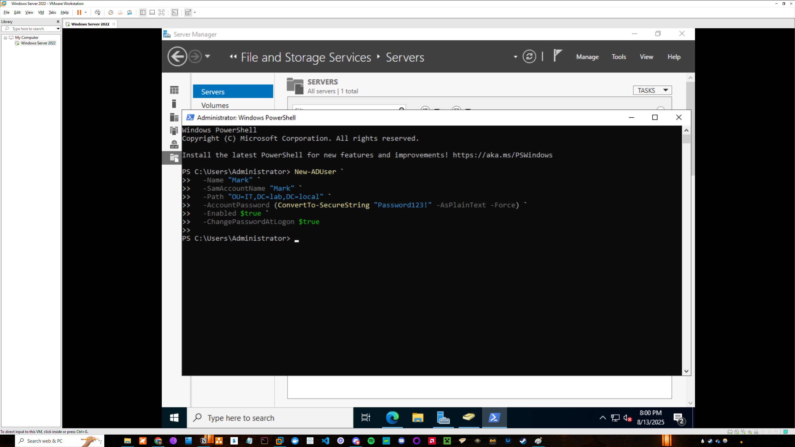

# Active Directory Deployment Project

## Overview
This project demonstrates the deployment and basic administration of Active Directory Domain Services (AD DS) using VMware. The goal was to simulate real-world IT support tasks and provide hands-on experience with user, organizational unit, group policy, and file share management.

**Technologies used:**
- Windows Server 2022
- Active Directory Domain Services
- PowerShell
- VMware Workstation

---

## Project Phases

### Phase 1: AD DS & DNS Installation

#### Windows Server installation ####

 
 
*Successfully installed Windows Server 2022 in a VM in VMware.*

#### Post AD DS installation ####

 
 
*The AD DS installation succeeded.*

#### Creation of New Forest ####

 
 
*Promoted the server to a Domain Controller and created a new forest named `lab.local`.*

#### AD DS and DNS Health Check ####

 
 
*AD DS and DNS are healthy; the SYSVOL replication warning is expected since this lab uses only one domain controller.*

---

### Phase 2: Organizational Units & User Creation

#### Creation of Organizational Units ####

 
 
*Created HR, IT, and Sales organizational units to simulate logical division of departments within a company.*

#### User Creation Via Powershell ####

 
 
*Created user 'Mark' using Powershell and assigned him to the IT organizational unit. Two other users were created using the GUI; Keith was placed in the HR OU, and Terry was placed in the Sales OU.*

---

### Phase 3: Group Policy Object Configuration

#### Windows Update Settings GPO Creation ####

 
 
*Configured a Windows Update Settings Group Policy Object that is applied to the HR, Sales, and IT departments. 
 
It removes the ability for users to pause updates. We do not want users pushing back updates because it could lead to security vulnerabilities and compatibility issues. 
 
It also enables automatic updates at 3:00 am everyday so that if an update needs to be installed, users are not interrupted while using their PC.*

#### Creation of IT_Admins Security Group ####

 
 
*Created a security group named IT_Admins. The purpose of this security group is to hold IT administrators so that an IT-specific Group Policy Object can be applied to these users.*

#### Adding User to Security Group ####

 
 
*Added user 'Mark' to the IT_Admins security group so that the IT-Specific policy we are creating can be applied to him.*

#### IT Policy Scope ####

 
 
*Here the scope of the IT-specific policy is shown. The policy applies only to members in the IT_Admins security group because we want this policy to give certain privileges to IT administrators that normal users won't have.*

#### IT Policy Details ####

 
 
*The specifics of the IT policy are shown. The ability to load and unload device drivers is given to IT administrators because they may need to install or update hardware drivers when troubleshooting or configuring systems, while standard users do not have this privilege to prevent accidental or malicious system changes. 
 
Remote Desktop Services has been enabled to allow IT administrators to remotely access and manage computers for troubleshooting, maintenance, and support tasks.*

---

### Phase 4: Shared Folder Configuration

#### Creation of Shared Folder ####

 
 
*Created a shared folder that will be accessible only to the HR and Sales departments. This simulates a real-world scenario where certain teams share resources while access is restricted for others.*

#### Modifying Shared Folder Permissions ####

 
 
*Configured NTFS permissions to grant HR and Sales groups full control of the shared folder. IT users were intentionally excluded to follow the principle of least privilege, ensuring access is only granted to those who need it.*

---

### Phase 5: Simple Password Reset Simulation

#### User Properties Before Reset ####

 
 
*Baseline account state for Keith before performing a password reset. The option 'User must change password at next logon' is checked to enforce best practices, ensuring administrators do not know users’ passwords.*

#### Resetting User's Password ####

 
 
*Resetting user Keith’s password in Active Directory. The new password is entered, and the option ‘User must change password at next logon’ remains checked to enforce security best practices.*
